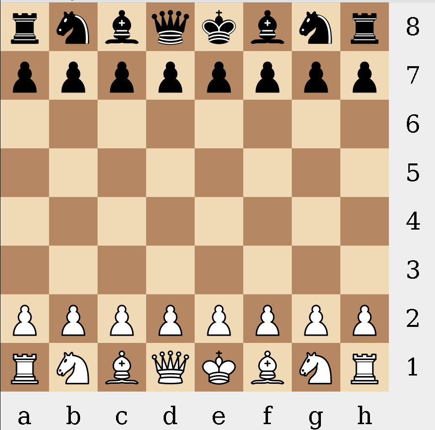
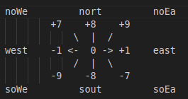
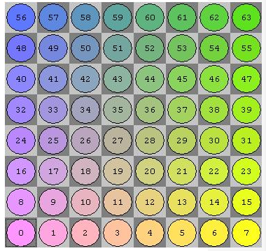

# JavaChess

My attempts at coding up a working Chess GUI and AI.
My motivations for such a project was to get used to bit operators which I haven't gotten familar but have seen in some of my uni projects, also that I wanted to get some CI running on github as I only have used Gitlabs CI before for uni projects.

Licensed under [MIT](https://github.com/notbeckhamster/JavaChess/blob/main/LICENSE)

[Download the latest JAR file](https://nightly.link/notbeckhamster/JavaChess/workflows/ant/main/JavaApp.zip)

Assuming you do have Java Runtime installed (I am using Java 17)
Extract Zip file and ensure you are in the JavaApp folder then run the following: java -jar JavaChess.jar

If that doesn't work navigate to the actions tab and scroll down to artifacts and download the JavaApp artifact and repeat steps above with regards to running the jar file. Or just clone the repo and run the ant cmd with no arguments to run the app (ie ant). 

## References
* Chess Programming Wiki for guidance. https://www.chessprogramming.org/Main_Page
* Sebastian Lague Coding Adventures: Chess for some inspiration with regards to the general direction and drew my attention since I haven't really tried using the Bit operators. 
https://www.youtube.com/watch?v=U4ogK0MIzqk
* Stack Over flow [answer](https://stackoverflow.com/a/4687759) from Hovercraft Full Of Eels. Which I referenced for the JLayeredPane idea, and the Drag and Drop logic.
* Board representation is the Little-Endian Rank-File Mapping [link](https://www.chessprogramming.org/Square_Mapping_Considerations) which implies the following compass rose and board representation:

* build.xml adapted from [https://ant.apache.org/manual/tutorial-HelloWorldWithAnt.html](https://ant.apache.org/manual/tutorial-HelloWorldWithAnt.html)

* FENN parser logic and description referenced from [link](http://www.fam-petzke.de/cp_fen_en.shtml), FENN description referenced from [link](https://www.chessprogramming.org/Forsyth-Edwards_Notation)
## Image Licensing
SVG chess pieces taken from [here](https://commons.wikimedia.org/wiki/Category:SVG_chess_pieces) by Cburnett licensed under [CC BY-SA 3.0](https://creativecommons.org/licenses/by-sa/3.0/)

## Other Projects Used 
The link generated for jar file in the README.md is from [oprypin](https://github.com/oprypin) project [nightly.link](https://github.com/oprypin/nightly.link) which gives a static link which is the latest jar artifact since GitHub always changes the links.

## Perft Results
Expected results were taken from [https://www.chessprogramming.org/Perft_Results](https://www.chessprogramming.org/Perft_Results). 
* Position 1 rnbqkbnr/pppppppp/8/8/8/8/PPPPPPPP/RNBQKBNR w KQkq - 0 1
* Position 2 r3k2r/p1ppqpb1/bn2pnp1/3PN3/1p2P3/2N2Q1p/PPPBBPPP/R3K2R w KQkq - 
* Position 3 8/2p5/3p4/KP5r/1R3p1k/8/4P1P1/8 w - - 
* Position 4 r3k2r/Pppp1ppp/1b3nbN/nP6/BBP1P3/q4N2/Pp1P2PP/R2Q1RK1 w kq - 0 1
* Position 5 rnbq1k1r/pp1Pbppp/2p5/8/2B5/8/PPP1NnPP/RNBQK2R w KQ - 1 8  
* Position 6 r4rk1/1pp1qppp/p1np1n2/2b1p1B1/2B1P1b1/P1NP1N2/1PP1QPPP/R4RK1 w - - 0 10 
