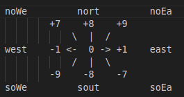
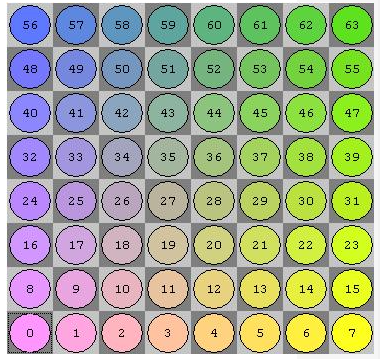

# JavaChess

My attempts at coding up a working Chess GUI and AI.
My motivations for such a project was to get used to bit operators which I haven't gotten familar with and becuase I like being terrible at chess.

Licensed under [MIT](https://github.com/notbeckhamster/JavaChess/blob/main/LICENSE)

[Download the latest JAR file](https://github.com/notbeckhamster/JavaChess/actions/artifacts/runID)

## References
* Chess Programming Wiki for guidance in terms of logic. https://www.chessprogramming.org/Main_Page
* Sebastian Lague Coding Adventures: Chess for some inspiration with regards to the general direction and drew my attention since I haven't really tried using the Bit operators. 
https://www.youtube.com/watch?v=U4ogK0MIzqk
* Stack Over flow [answer](https://stackoverflow.com/a/4687759) from Hovercraft Full Of Eels. Which I referenced for the JLayeredPane idea, and the Drag and Drop logic.
* Board representation is the Little-Endian Rank-File Mapping (link)[https://www.chessprogramming.org/Square_Mapping_Considerations] which implies the following compass rose and board representation:

* build.xml adapted from [https://ant.apache.org/manual/tutorial-HelloWorldWithAnt.html](https://ant.apache.org/manual/tutorial-HelloWorldWithAnt.html)
## Image Licensing
SVG chess pieces taken from [here](https://commons.wikimedia.org/wiki/Category:SVG_chess_pieces) by Cburnett licensed under [CC BY-SA 3.0](https://creativecommons.org/licenses/by-sa/3.0/)